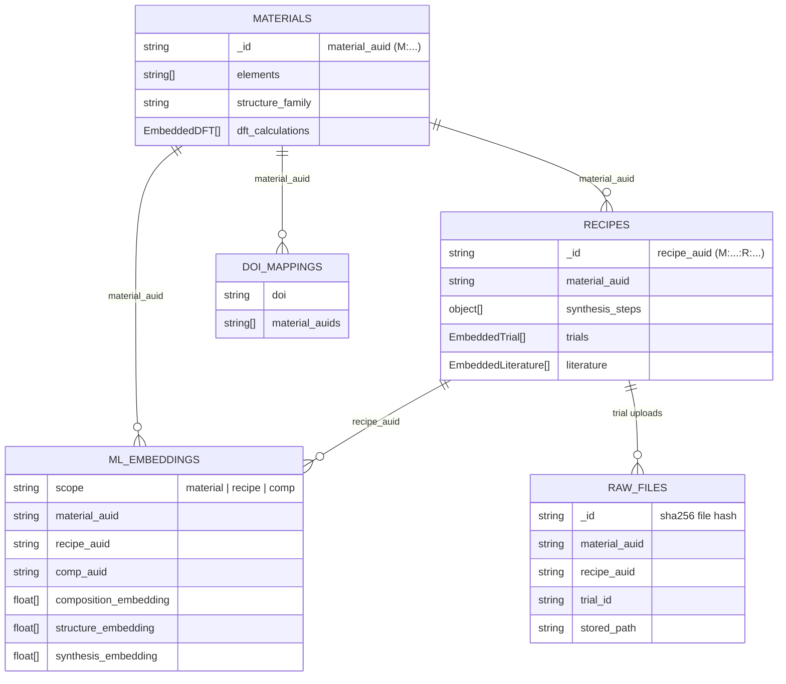

# LOOP

[](https://github.com/entropy4energy/loop/actions/workflows/ci.yml)

AUID-addressable materials data platform for uploading, browsing, and analyzing experimental, literature, and computational records on high-entropy materials. Backed by MongoDB's document model with a separate flat raw-file database for backup and portability.

## Data model



Two MongoDB databases:

| Database | URI env var | Collections |
|---|---|---|
| `loop` (primary) | `MONGODB_URI` | `materials`, `recipes`, `ml_embeddings`, `doi_mappings`, `pending_data`, `user_affiliations` |
| `loop_raw` (backup) | `MONGODB_RAW_URI` | `raw_files` |

### AUIDs

Content-addressable ids based on `sha256`, truncated to 12 hex chars, type-prefixed:

- `material_auid` — `M:<hash>` — hash of `(elements, structure_family)`
- `recipe_auid` — `M:<hash>:R:<hash>` — composite; prefix matches parent material
- `comp_auid` — `M:<hash>:C:<hash>` — composite; identifies a specific DFT input set
- `trial_id` — sequential per-material string (e.g. `04_16_2026_1`), unique within a material
- `file_hash` — raw `sha256` of uploaded bytes; also the `_id` in `raw_files`

Canonicalization (lowercase, sorted keys, 4 sig-fig floats, no empty values) lives in [catalog/auid.py](catalog/auid.py).

## Development

### Requirements

- Docker + Docker Compose

### Start

```bash
cp .env.example .env
docker compose -f docker-compose.dev.yml up --build
```

Visit [http://localhost:8000](http://localhost:8000). Migrations run automatically on startup.

### Common commands

```bash
# Shell into the web container
docker compose -f docker-compose.dev.yml exec web bash

# Run tests
docker compose -f docker-compose.dev.yml run --rm web python manage.py test

# DB health check
docker compose -f docker-compose.dev.yml exec web python manage.py mongo_admin health

# Rebuild indexes
docker compose -f docker-compose.dev.yml exec web python manage.py mongo_admin reindex

# Backup / restore
docker compose -f docker-compose.dev.yml exec web python manage.py mongo_admin backup-run --archive loop-backup.archive.gz --yes
docker compose -f docker-compose.dev.yml exec web python manage.py mongo_admin backup-raw --archive loop-raw-backup.archive.gz --yes
```

Full `mongo_admin` subcommands: `health`, `reindex`, `audit`, `drop-legacy`, `ensure-vector-indexes`, `backup-run`, `restore-run`, `backup-raw`, `restore-raw`.

### Testing

MongoDB must be reachable before `manage.py test` starts. Both CI and `docker-compose.dev.yml` use the `mongodb/mongodb-atlas-local` image.

If your local dev stack was initialized before `/data/configdb` was persisted in
`docker-compose.dev.yml`, do a one-time cleanup of the stale Mongo volume before
restarting the stack:

```bash
docker compose -f docker-compose.dev.yml down
docker volume rm loop_mongodb_data
```

The Atlas Local image now recreates its replica-set keyfile automatically under
the persisted `mongodb_configdb` volume. No manual keyfile editing is required.

- Skip live-DB tests: `SKIP_MONGO_TESTS=1`
- Run only Mongo-tagged tests: `python manage.py test --tag=mongo`

### ChemScreen predictions

LOOP can sync the native artifacts produced by
[ChemScreen](https://github.com/entropy4energy/ChemScreen): its observed
`lib5`/`lib6` EFA, DEED, and d2h JSON plus a precomputed `all_predictions`
CSV/JSON/JSONL. The focused oxide screen then keeps only near-equimolar,
five-cation 3d transition-metal oxides, flags processing concerns, and displays
the top 20 of ChemScreen's eligible candidate pool with thermodynamic,
structure, route, temperature, DFT, and experimental evidence. Missing EFA and
DEED values are filled only when a validated LOOP/ChemScreen model is active,
and every inferred value is labeled with its model version. If both EFA and
DEED are available, LOOP derives a missing d2h using ChemScreen's
`DEED = sqrt(EFA / d2h)` relationship. Experimental single-phase outlooks use
a weighted nearest-neighbor estimate over ChemScreen's measured `exp_truth`
records and remain labeled as unvalidated unless the composition has an exact
experimental match. When no LOOP synthesis recipes exist, route and
temperature cells use a cited high-entropy-oxide literature prior rather than
appearing blank; these priors never count as DFT or experimental evidence.

When no exact or neighboring LOOP recipe is available, the Predictions tab
now builds a material-specific synthesis estimate from precursor stoichiometry,
precursor melting/decomposition behavior, the Tammann rule, target structure,
DFT/model hull distance, cached AFLOW features, and ChemScreen experimental
neighbors. The result includes a method, atmosphere, heating window, cooling
choice, confidence, evidence, and an explicit TGA/DSC/phase-diagram validation
warning. It is stored in MongoDB's ``synthesis_predictions`` collection as a
low-weight pseudo-label; it is never stored as a verified ``Recipe``. Later
experimental or literature recipes therefore outrank generated routes during
composition-model training.

```bash
python manage.py backfill_synthesis_predictions
```

Development startup runs ``ensure_prediction_data`` when
``CHEMSCREEN_BOOTSTRAP_ON_START=1``. It imports ChemScreen only when fewer than
20 eligible five-cation 3d oxides exist, so the Predictions tab cannot silently
collapse to one row on a fresh database.

ChemScreen is pinned as the `vendor/ChemScreen` Git submodule. After a fresh
LOOP clone, hydrate it with:

```bash
git submodule update --init --recursive
```

```bash
python manage.py import_chemscreen \
  --root vendor/ChemScreen \
  --predictions /path/to/all_predictions.csv \
  --metric d2h \
  --model-name "ChemScreen RF"
```

Use the model's actual training target for `--metric` (for example `EFA`,
`DEED`, or `d2h`). Run with `--dry-run` first to validate every artifact
without writing to MongoDB. The same values can be configured through the
`CHEMSCREEN_*` environment variables in `.env.example`.

#### Continuous EFA/DEED training

New computational, experimental, literature, and ChemScreen imports enqueue a
coalesced background training request. A numeric EFA/DEED ground-truth record
is first compared with the active model:

- within the configured error tolerances: record a `reward` and weight the
  verified example `1.25x`;
- outside either tolerance: record a `flag` and weight the hard example `2x`;
- no numeric EFA/DEED truth: preserve the upload, but do not fabricate a
  training label.

ChemScreen uses a Random Forest, which is retrained from the complete labeled
corpus rather than incrementally fitting one row. Every candidate is stored as
a versioned artifact with cross-validated MAE/RMSE/R². It becomes active only
when normalized validation MAE is no worse than the current version.

```bash
# Train immediately
python manage.py train_chemscreen_models

# Or queue/process the same background workflow
python manage.py train_chemscreen_models --enqueue
python manage.py train_chemscreen_models --process-pending
```

#### AFLOW

LOOP accesses the public AFLOW AFLUX API and caches exact-species formation
enthalpy and electronic-entropy records as model features. AFLOW does not
publish EFA or DEED as direct AFLUX properties; those two columns are produced
by the versioned ChemScreen-style regressors trained on labeled LOOP/ChemScreen
data. Existing CHAOS/AFLOW-format records are also used when available.

### Fresh wipe

```bash
docker compose -f docker-compose.dev.yml down -v
docker compose -f docker-compose.dev.yml up --build
```
