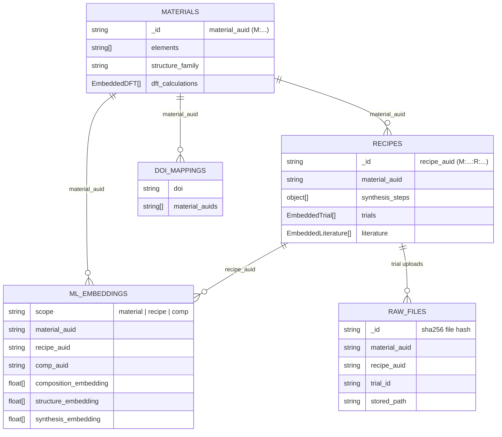

# LOOP

[](https://github.com/entropy4energy/loop/actions/workflows/ci.yml)

AUID-addressable materials data platform for uploading, browsing, and analyzing experimental, literature, and computational records on high-entropy materials. Backed by MongoDB's document model with a separate flat raw-file database for backup and portability.

## Data model



Two MongoDB databases:

| Database | URI env var | Collections |
|---|---|---|
| `loop` (primary) | `MONGODB_URI` | `materials`, `recipes`, `ml_embeddings`, `doi_mappings`, `pending_data`, `user_affiliations` |
| `loop_raw` (backup) | `MONGODB_RAW_URI` | `raw_files` |

### AUIDs

Content-addressable ids based on `sha256`, truncated to 12 hex chars, type-prefixed:

- `material_auid` — `M:<hash>` — hash of `(elements, structure_family)`
- `recipe_auid` — `M:<hash>:R:<hash>` — composite; prefix matches parent material
- `comp_auid` — `M:<hash>:C:<hash>` — composite; identifies a specific DFT input set
- `trial_id` — sequential per-material string (e.g. `04_16_2026_1`), unique within a material
- `file_hash` — raw `sha256` of uploaded bytes; also the `_id` in `raw_files`

Canonicalization (lowercase, sorted keys, 4 sig-fig floats, no empty values) lives in [catalog/auid.py](catalog/auid.py).

## Development

### Requirements

- Docker + Docker Compose

### Start

```bash
cp .env.example .env
docker compose -f docker-compose.dev.yml up --build
```

Visit [http://localhost:8000](http://localhost:8000). Migrations run automatically on startup.

### Common commands

```bash
# Shell into the web container
docker compose -f docker-compose.dev.yml exec web bash

# Run tests
docker compose -f docker-compose.dev.yml run --rm web python manage.py test

# DB health check
docker compose -f docker-compose.dev.yml exec web python manage.py mongo_admin health

# Rebuild indexes
docker compose -f docker-compose.dev.yml exec web python manage.py mongo_admin reindex

# Backup / restore
docker compose -f docker-compose.dev.yml exec web python manage.py mongo_admin backup-run --archive loop-backup.archive.gz --yes
docker compose -f docker-compose.dev.yml exec web python manage.py mongo_admin backup-raw --archive loop-raw-backup.archive.gz --yes
```

Full `mongo_admin` subcommands: `health`, `reindex`, `audit`, `drop-legacy`, `ensure-vector-indexes`, `backup-run`, `restore-run`, `backup-raw`, `restore-raw`.

### Testing

MongoDB must be reachable before `manage.py test` starts. Both CI and `docker-compose.dev.yml` use the `mongodb/mongodb-atlas-local` image.

- Skip live-DB tests: `SKIP_MONGO_TESTS=1`
- Run only Mongo-tagged tests: `python manage.py test --tag=mongo`

### Fresh wipe

```bash
docker compose -f docker-compose.dev.yml down -v
docker compose -f docker-compose.dev.yml up --build
```
